# Bufi Financial Dashboard - System Architecture and Data Flow

## Table of Contents
1. [System Overview](#system-overview)
2. [Architecture Components](#architecture-components)
3. [Data Flow](#data-flow)
4. [Database Architecture](#database-architecture)
5. [Security Implementation](#security-implementation)
6. [Performance Optimizations](#performance-optimizations)
7. [Comprehensive End-to-End Data Flow](#comprehensive-end-to-end-data-flow)

## System Overview

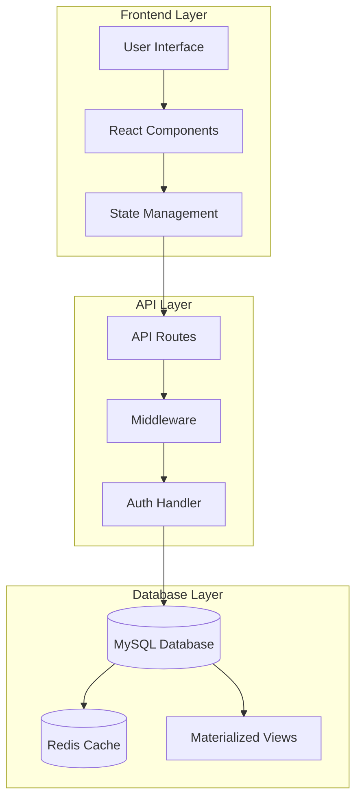

The Bufi Financial Dashboard implements a three-tier architecture:
1. **Frontend Layer**: Next.js with TypeScript for robust UI
2. **API Layer**: RESTful services for data handling
3. **Database Layer**: MySQL for persistent storage with Redis caching

## Architecture Components

### Frontend Architecture

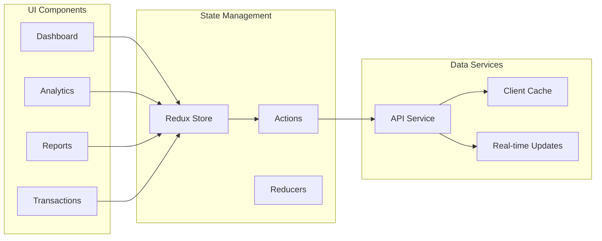

### Component Structure
- **Dashboard**: Main interface for financial overview
- **Analytics**: Advanced financial analysis tools
- **Reports**: Customizable reporting system
- **Transactions**: Transaction management interface

## Data Flow

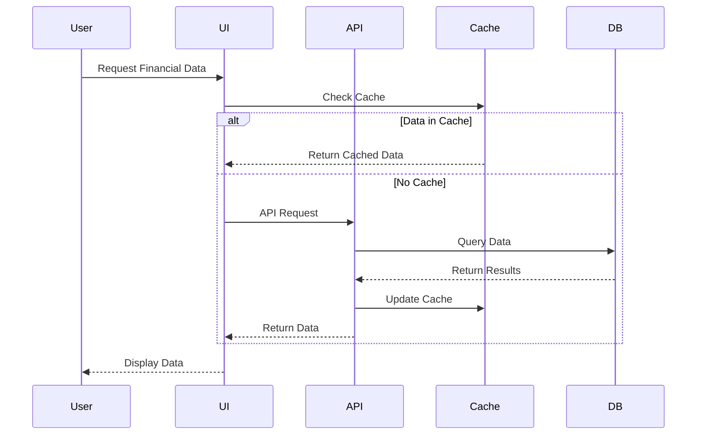

### Data Processing Pipeline

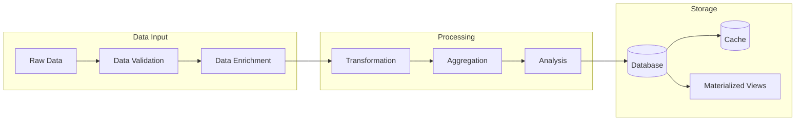

## Database Architecture

### Schema Design

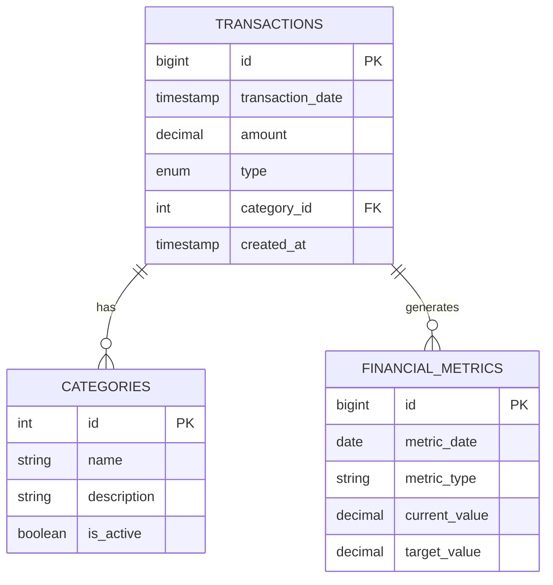

### Query Flow

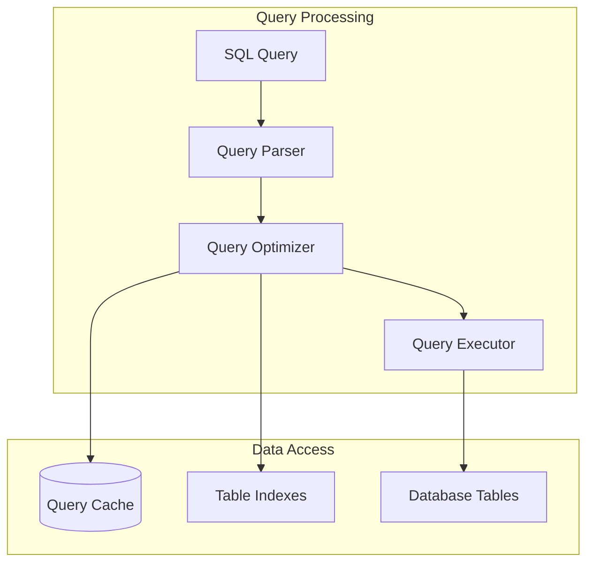

## Security Implementation

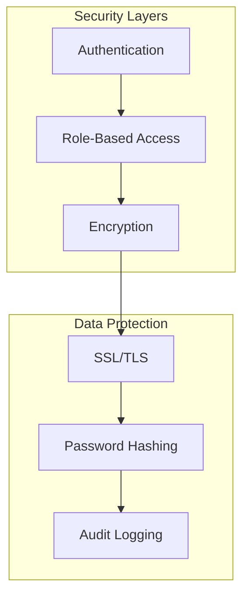

## Performance Optimizations

### Caching Strategy

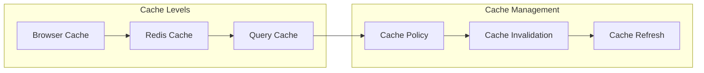

### Query Optimization

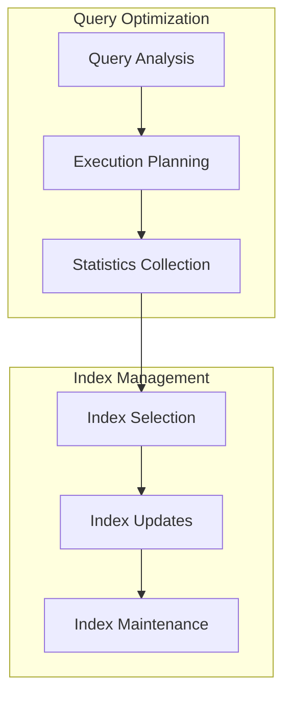

## Real-time Processing

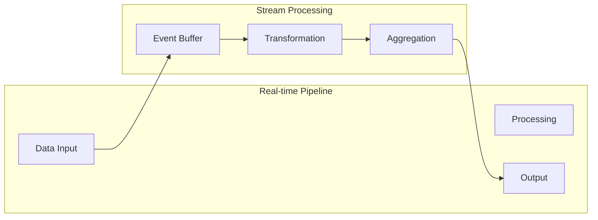

## Deployment Architecture

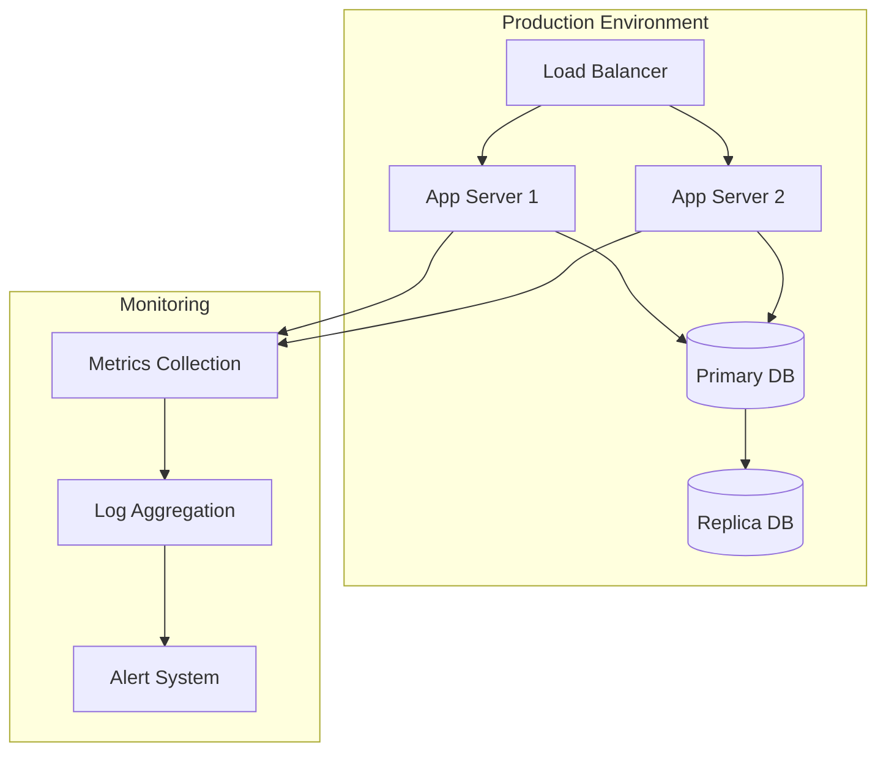

## Development Workflow

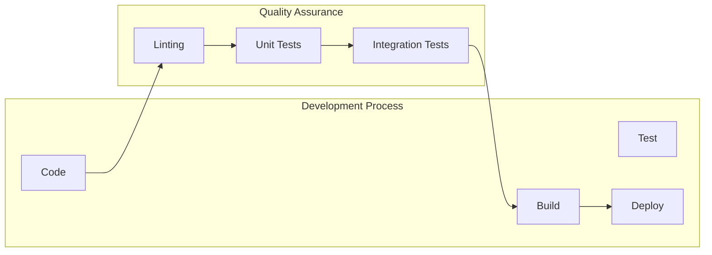

## Comprehensive End-to-End Data Flow

### Complete System Data Flow

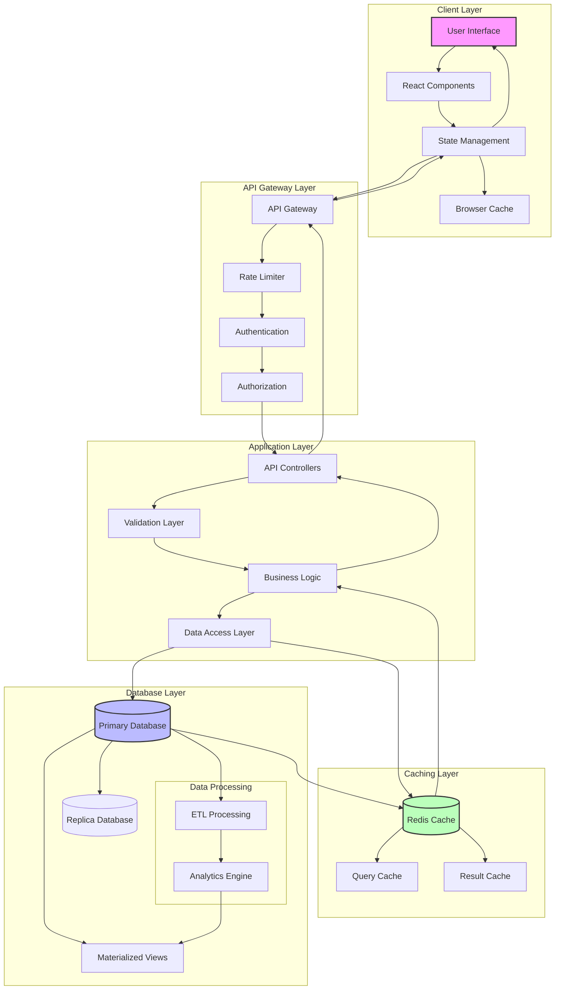

### Detailed Data Flow Explanation

#### 1. Client-Side Flow
- **User Interface (UI)**
  - Handles user interactions and input
  - Manages form submissions and data display
  - Implements responsive design and user feedback

- **React Components**
  - Implements reusable UI components
  - Manages component lifecycle
  - Handles local state and props

- **State Management**
  - Centralizes application state using Redux
  - Manages data synchronization
  - Handles optimistic updates
  - Implements client-side caching

#### 2. API Gateway Layer
- **API Gateway**
  - Routes requests to appropriate services
  - Handles request/response transformation
  - Implements API versioning
  - Manages CORS and security headers

- **Security Controls**
  - Rate limiting for API protection
  - Authentication verification
  - Authorization checks
  - Request validation

#### 3. Application Layer
- **Controllers**
  - Handle incoming HTTP requests
  - Manage request routing
  - Implement endpoint logic
  - Handle response formatting

- **Business Logic**
  - Implements core business rules
  - Manages transaction workflows
  - Handles data validation
  - Processes financial calculations

- **Data Access Layer**
  - Manages database connections
  - Implements repository pattern
  - Handles query execution
  - Manages transaction boundaries

#### 4. Caching Layer
- **Redis Cache**
  - Stores frequently accessed data
  - Manages cache invalidation
  - Implements cache policies
  - Handles distributed caching

- **Query/Result Cache**
  - Caches complex query results
  - Stores computed aggregations
  - Manages cache lifetime
  - Implements cache warming

#### 5. Database Layer
- **Primary Database**
  - Stores transactional data
  - Manages ACID compliance
  - Handles write operations
  - Maintains data integrity

- **Data Processing**
  - ETL operations for data transformation
  - Analytics processing
  - Report generation
  - Historical data management

### Data Flow Scenarios

#### 1. Read Operation Flow
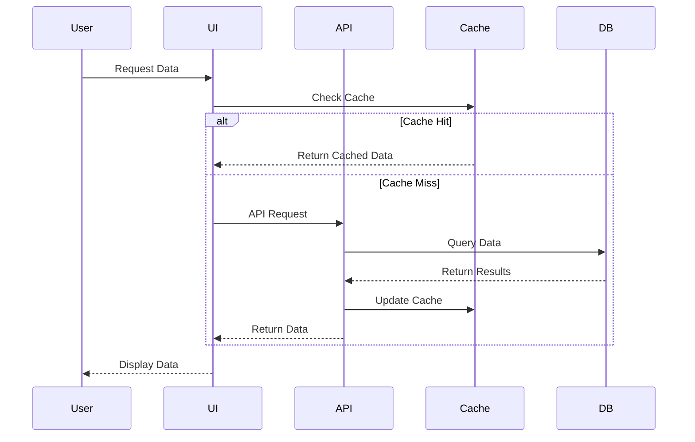

#### 2. Write Operation Flow
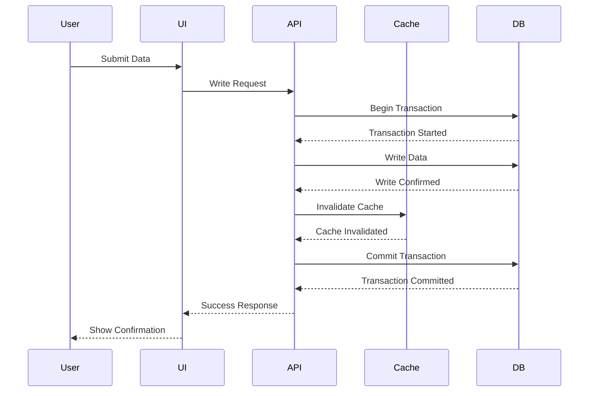

### Performance Considerations

1. **Caching Strategy**
   - Multi-level caching (Browser, API, Database)
   - Cache invalidation patterns
   - Cache warming procedures
   - Cache hit ratio monitoring

2. **Query Optimization**
   - Indexed queries
   - Query plan optimization
   - Connection pooling
   - Batch processing

3. **Real-time Processing**
   - Event-driven updates
   - WebSocket connections
   - Server-sent events
   - Real-time analytics

4. **Data Consistency**
   - Transaction management
   - Eventual consistency
   - Data synchronization
   - Conflict resolution

This comprehensive data flow documentation provides a detailed understanding of how data moves through the Bufi Financial Dashboard system, from user interaction to data storage and back. The diagrams and explanations cover both read and write operations, along with important considerations for performance, security, and data consistency.

This documentation provides a comprehensive overview of the Bufi Financial Dashboard's architecture and data flow. The diagrams illustrate the relationships between different components and how data moves through the system. For implementation details, refer to the specific code files and database schemas in the project repository.

## Database Management System Architecture

### Complete Database System Overview

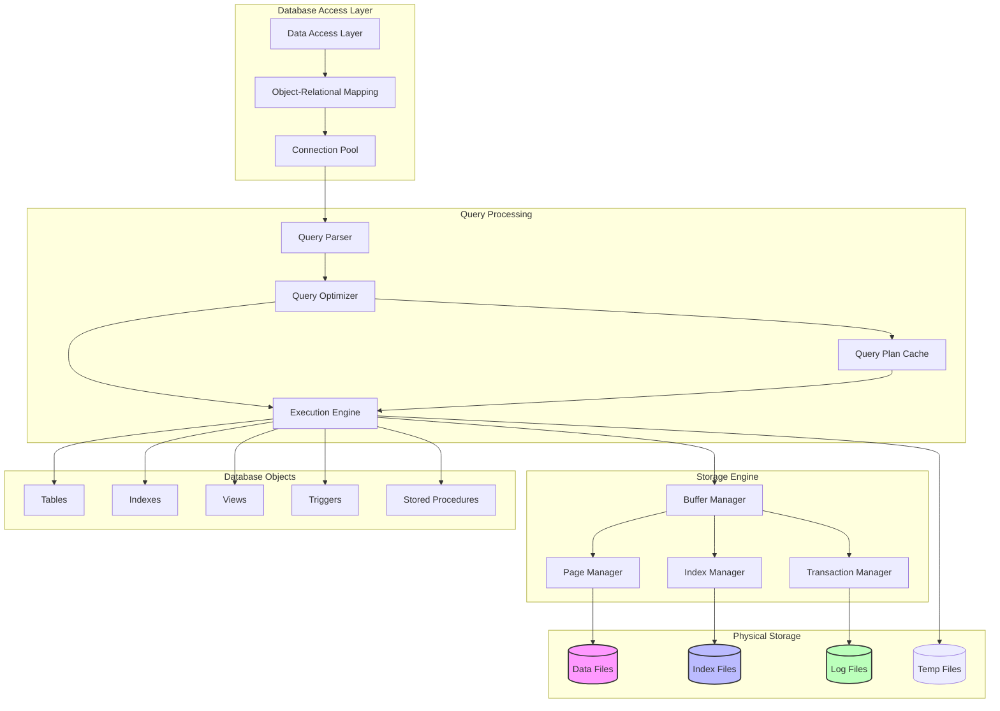

### Database Schema Architecture

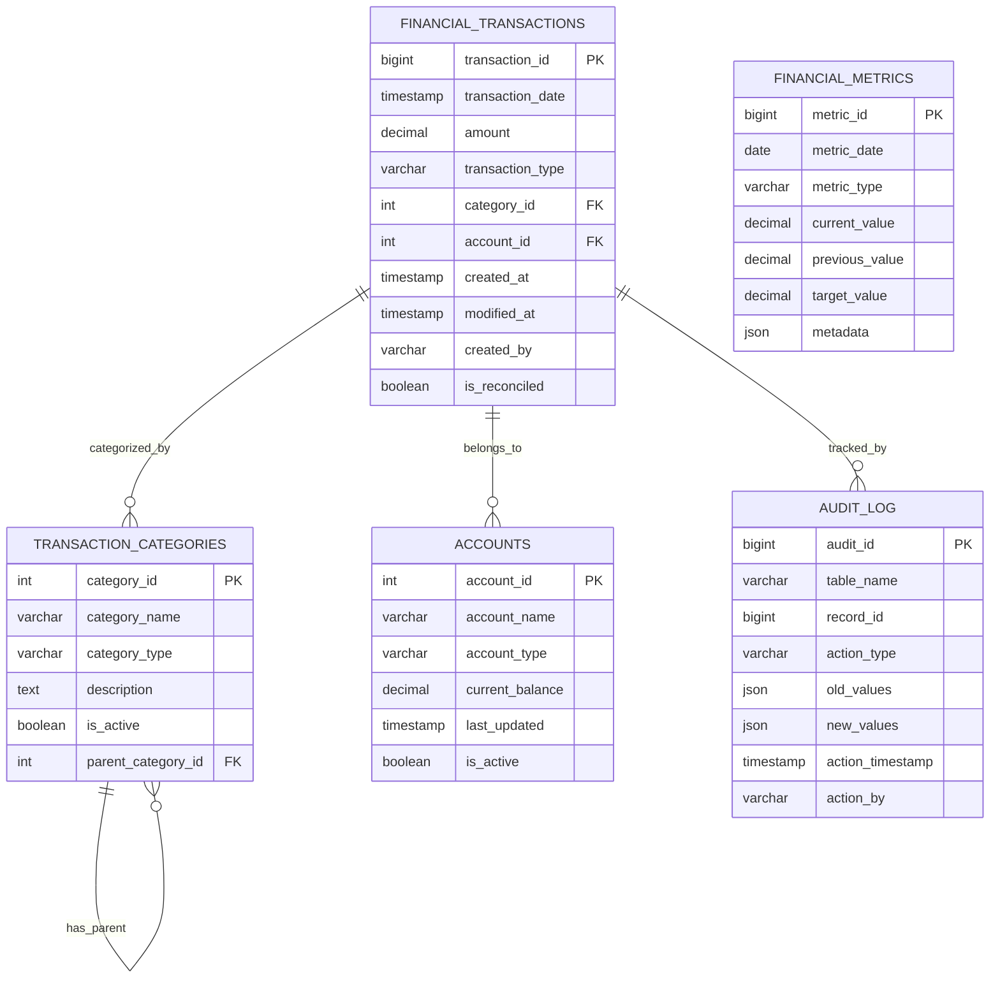

### Database Operations Flow

#### 1. Transaction Processing Flow
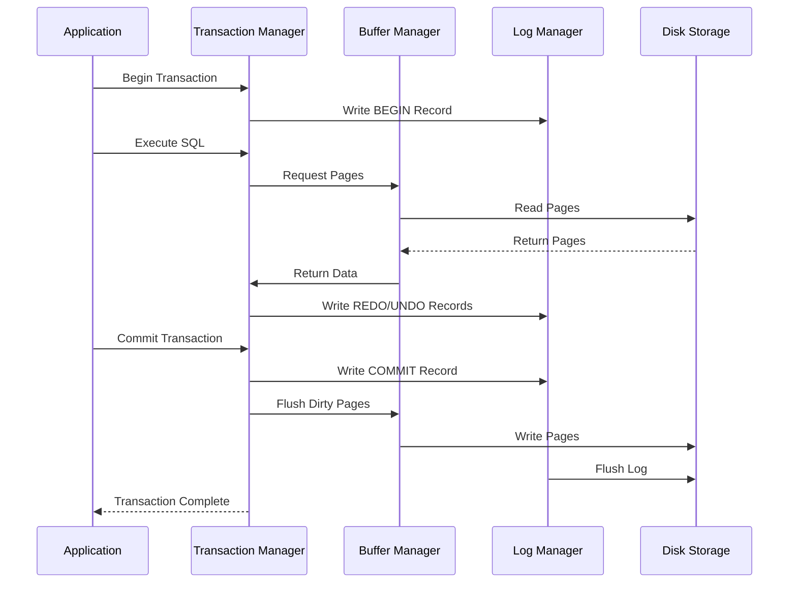

### Database Optimization Techniques

#### 1. Index Strategy
```sql
-- Primary Indexes
CREATE INDEX idx_transaction_date ON financial_transactions(transaction_date);
CREATE INDEX idx_category_type ON transaction_categories(category_type);

-- Composite Indexes for Common Queries
CREATE INDEX idx_trans_date_type ON financial_transactions(transaction_date, transaction_type);
CREATE INDEX idx_account_balance ON accounts(account_type, current_balance);

-- Covering Indexes for Performance
CREATE INDEX idx_trans_reporting ON financial_transactions(
    transaction_date,
    amount,
    transaction_type,
    category_id
) INCLUDE (is_reconciled);
```

#### 2. Materialized Views
```sql
CREATE MATERIALIZED VIEW mv_daily_financial_summary AS
SELECT 
    DATE(transaction_date) as trans_date,
    transaction_type,
    category_id,
    COUNT(*) as transaction_count,
    SUM(amount) as total_amount,
    AVG(amount) as avg_amount
FROM financial_transactions
GROUP BY 
    DATE(transaction_date),
    transaction_type,
    category_id
WITH DATA;

-- Refresh Strategy
CREATE PROCEDURE refresh_financial_summary()
BEGIN
    REFRESH MATERIALIZED VIEW mv_daily_financial_summary;
END;
```

#### 3. Partitioning Strategy
```sql
-- Range Partitioning by Date
CREATE TABLE financial_transactions (
    -- columns definition
) PARTITION BY RANGE (YEAR(transaction_date)) (
    PARTITION p_2023 VALUES LESS THAN (2024),
    PARTITION p_2024 VALUES LESS THAN (2025),
    PARTITION p_future VALUES LESS THAN MAXVALUE
);

-- List Partitioning by Transaction Type
CREATE TABLE transaction_history (
    -- columns definition
) PARTITION BY LIST (transaction_type) (
    PARTITION p_credits VALUES IN ('CREDIT', 'REFUND'),
    PARTITION p_debits VALUES IN ('DEBIT', 'WITHDRAWAL'),
    PARTITION p_others VALUES IN ('ADJUSTMENT', 'TRANSFER')
);
```

### Performance Monitoring

#### 1. Query Performance Analysis
```sql
-- Monitor Query Performance
CREATE TABLE query_performance_log (
    query_id BIGINT PRIMARY KEY,
    query_text TEXT,
    execution_time DECIMAL(10,2),
    rows_affected INT,
    cpu_time DECIMAL(10,2),
    logical_reads INT,
    physical_reads INT,
    execution_plan TEXT,
    timestamp TIMESTAMP DEFAULT CURRENT_TIMESTAMP
);

-- Index Usage Statistics
CREATE VIEW v_index_usage_stats AS
SELECT 
    t.name AS table_name,
    i.name AS index_name,
    ius.user_seeks,
    ius.user_scans,
    ius.user_lookups,
    ius.user_updates
FROM sys.dm_db_index_usage_stats ius
JOIN sys.tables t ON ius.object_id = t.object_id
JOIN sys.indexes i ON ius.index_id = i.index_id;
```

### Data Integrity and Recovery

#### 1. Backup Strategy
```sql
-- Backup Procedures
CREATE PROCEDURE perform_full_backup()
BEGIN
    -- Full backup logic
    BACKUP DATABASE bufi_finance 
    TO DISK = '/backups/full/bufi_finance_full.bak'
    WITH COMPRESSION, CHECKSUM;
END;

CREATE PROCEDURE perform_differential_backup()
BEGIN
    -- Differential backup logic
    BACKUP DATABASE bufi_finance 
    TO DISK = '/backups/diff/bufi_finance_diff.bak'
    WITH DIFFERENTIAL, COMPRESSION;
END;
```

#### 2. Transaction Recovery
```sql
-- Transaction Recovery Log
CREATE TABLE transaction_recovery_log (
    recovery_id BIGINT PRIMARY KEY,
    transaction_id BIGINT,
    recovery_type VARCHAR(50),
    recovery_status VARCHAR(50),
    error_message TEXT,
    recovery_timestamp TIMESTAMP,
    recovered_by VARCHAR(100)
);

-- Recovery Procedure
CREATE PROCEDURE recover_failed_transaction(IN p_transaction_id BIGINT)
BEGIN
    DECLARE EXIT HANDLER FOR SQLEXCEPTION
    BEGIN
        -- Handle recovery errors
        INSERT INTO transaction_recovery_log 
        (transaction_id, recovery_type, recovery_status, error_message)
        VALUES 
        (p_transaction_id, 'AUTOMATIC', 'FAILED', SQLERRM);
        ROLLBACK;
    END;

    START TRANSACTION;
    -- Recovery logic here
    COMMIT;
END;
```

This DBMS-focused documentation provides a detailed view of:
- Database architecture and components
- Schema design and relationships
- Transaction processing
- Optimization techniques
- Performance monitoring
- Data integrity and recovery procedures

Would you like me to:
1. Add more specific database optimization techniques?
2. Include more complex query examples?
3. Add more details about transaction management?
4. Expand the monitoring and recovery sections? 